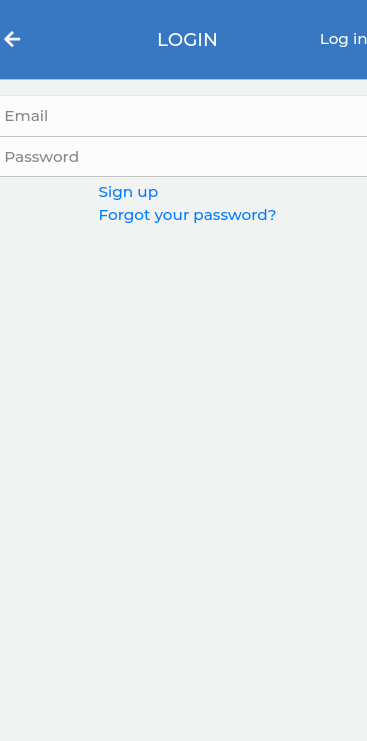
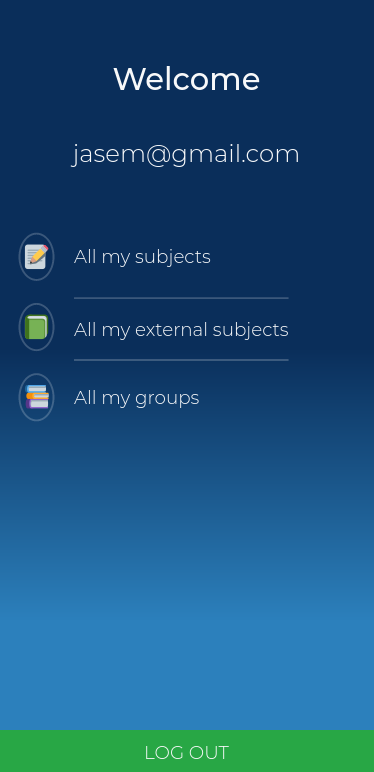

# VavaTracker App 🚀
This project is built in Ruby on Rails and it is based on an app for tracking the number of hours that a user studies. 

You can create a user and log into the app, the main profile page is divided by "All my subjects", "All external subjects" and "All my groups". 

When a user opens "All my subjects" page, the total amount of hours and a list of all studies subject are displayed, inside of that page you can create a new subject by clicking "Add new". 

When a user opens "All my external subjects" a list of all external subjects is listed but not assigned to any group, it is sorted by most recent. The design is similar to the "All my subjects". 

When a user opens "All my groups", a list of all groups is displayed, each group had its icon, name, and creation date. Each group is clickable and opens "groups subjects" page. And action button "Create new" is displayed. The design is similar to the "User profile page".

When a user creates a new group an email is sending to the user's mail remembering that a new group is created.

## Login

## Profile Page

## Live version

-   Heroku: [Vava-Tracker](https://vavatracker.herokuapp.com/)

## Built With

-   ruby '2.7.1'
-   'rails', '~> 6.0.3', '>= 6.0.3.2'

## Getting Started

​To have a version on your local machine:

-   Clone this repository
-   Open a terminal on the containing folder of this project
-   Run 'bundle install' to install the dependencies
-   Set the database using the command 'bin/rake db:migrate'
-   Run the server using the command 'rails server'
-   Access http://localhost:3000/ in your browser
-   Use the links, forms and buttons to explore the features and create objects in our database

## Author

👤 **Jasem Duncan Valencia Vargas**

-   Github: [@JasemDuncan](https://github.com/JasemDuncan)
-   Linkedin: [@Jasem-Duncan-Valencia](https://www.linkedin.com/in/jasem-duncan-valencia/)

## 🤝 Link To The Project On Github: 

[Project On Github](https://github.com/JasemDuncan/vava-tracker)

## 🤝 Contributing

Contributions, issues and feature requests are welcome!

Feel free to check the [issues page](https://github.com/JasemDuncan/vava-tracker/issues).

## Show your support

Give a ⭐️ if you like this project!

## Acknowledgments

- Project inspired by Microverse Program.
- The layout, colors and inspiration was taken from a design by Gregoire Vella. The original design elements and guide can be fount at Behance website.
- On this website, there is mention of fictional characters, rights are property of CBS® and do not hold any relationship with the project. The use of the names and images is solely for educational purposes.
